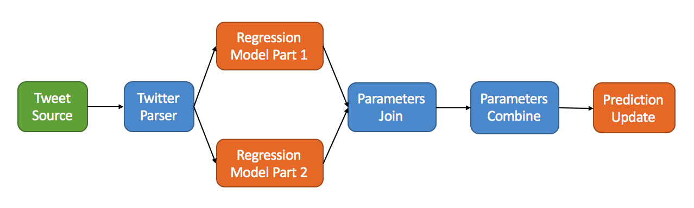

Flink on AWS
===================

A streaming benchmark on Flink.

This work is finished by Xu Zhenqiang(jkadbear@gmail.com) at Advanced Digital Sciences Center (ADSC). 

The topology is implemented in `flink-example` project. Under `script` folder, there lies some dirty shell scripts for operating cloud machines. 

`analysis.html` shows the result generated from `LOGS`. Because the log files are so large, we only provide one example `LOGS/20161212/5000-600/600.log` in this git repo.


## Streaming Topology



The topology is a linear regression model to predict the future frequencies of tweet hashtags. The input tweets are stored in JSON format. Twitter Parser is a stateless operator, on receiving a new tweet, it parses the incoming tweet into contents and attributes. For each hashtag in the tweet, a tuple containing the hashtag and the creation time of the tweet are emitted from Twitter Parser. Two stateful operators are the downstream neighbors of Twitter Parser, each of them is responsible for computing a part of the parameters for the regression model. Parameters Join applies a join operation on these two parameter streams, with the join key as the hashtag and the result tuples contain all the parameters delivered in the input streams. The next stateless operator, Parameter Combine calculates the linear coefficient. Prediction Update is a stateful operator, which predicts the frequency of hashtag in the next batch with the linear regression model and updates the results in its state.

## Deploy & Run

We have to compare the performance of Storm, so we use AWS-EC2 instead of convenient AWS-EMR. Please follow the [official instructions](https://ci.apache.org/projects/flink/flink-docs-release-1.3/setup/cluster_setup.html) to deploy a Flink cluster on AWS-EC2.

### Package the benchmark program

Run `mvn clean package` under `flink-example` to generate `flink-example-1.0.jar`, then upload it to Cloud.

### Run Application

With Flink installed, run the following command to start a job.

```bash
flink run /path/to/flink-example-1.0.jar --rate 1000 --isCkp true --ckpInterval 5000 --isS3 true
```

#### Application options

- rate: speedup factor on actual data stream
- isCkp: enable/disable Flink fault tolerance mechanism
- ckpInterval: set checkpoint interval (milliseconds)
- isS3: read source from S3 or local file system
- dataPath: source path of local file system (used when isS3=false)

You are suggested to run the application for 10 mins every time.

## Result

After running the benchmark multiple times and collecting the logs, we use jupyter to analyse data. The figure below summarizes the result.


In the result figure (Rate means throughput), it can be concluded that:

- with throughput increasing, Flink's Latency increases slowly before threshold
- the system reaches its limit when the input rate equals 4000
- under same situation, shorter checkpiont interval leads to higher latency

Compared to the performance of Storm, we can see that Flink is nearly twice better than Storm in this case.

For more details, please read `analysis.html`.

## Acknowledgement

This work was partially supported by SingAREN/AWS Cloud Credit for Research Program 2016.
